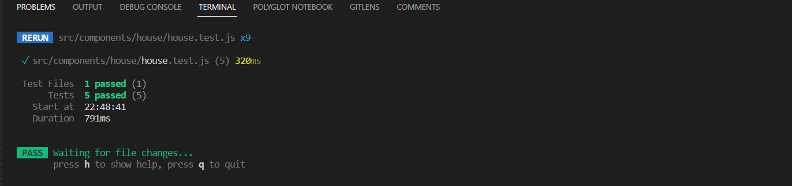
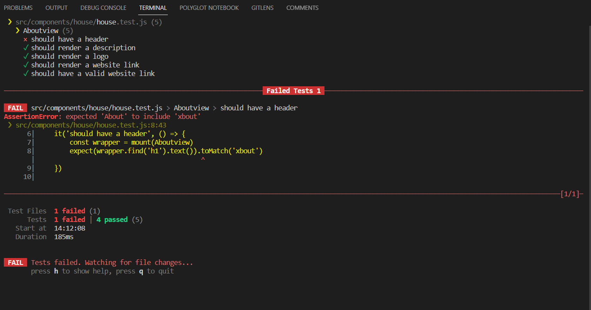

### House test rapport
***
1. In the first test im checking if the h1 tag has about in it 

2. the 2nd test im checking if the description has Lorem ispum in it 

3. 3th test im checking if im using the right logo

4. 4th test if there is a tag with the website link in it 

5. 5th i'm checking if the href is send me to the right website link 

#### This is how it wil look if everything goes right 

#### This is how it wil look if there is a error or something is missing or it doesn't match

